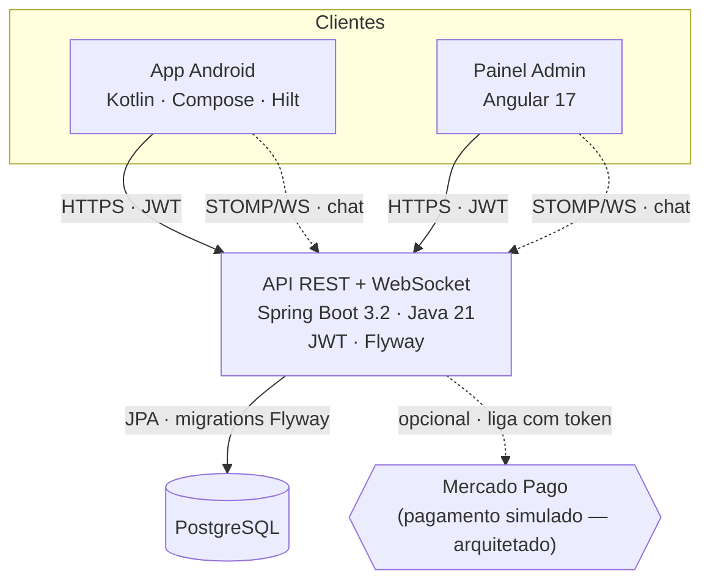

<div align="center">

# 🛒 Fast Trade

**Marketplace full-stack de compra, venda e troca — app Android, painel web e API REST.**

[](https://github.com/Alexandregv1080p/Fast-Trade/actions/workflows/ci.yml)


</div>

Monorepo com três aplicações sobre a mesma API:

| App | Stack | Papel |
|-----|-------|-------|
| **backend/** | Java 21 · Spring Boot 3.2 · PostgreSQL · JWT · WebSocket | API REST + realtime |
| **frontend/** | Angular 17 · ApexCharts · STOMP/SockJS | Painel administrativo |
| **android/** | Kotlin · Jetpack Compose · Hilt · Retrofit | App do cliente |

---

## Demonstração

<!--
  SHOT LIST — capture na sua máquina e salve em docs/screenshots/ com ESTES nomes.
  (Android Studio: Emulator → ícone de câmera p/ print; ícone de vídeo p/ o GIF.)

  Android:    android-home.png · android-product.png · android-cart.png ·
              android-checkout.png · android-payment.png · android-orders.png ·
              android-chat.png · android-profile.png
  Admin (web): admin-dashboard.png · admin-products.png
  Engenharia:  swagger.png (Swagger UI) · ci.png (CI verde no GitHub Actions)
  Hero:        checkout.gif (fluxo carrinho → pagamento)

  Dica: enquanto não colar um arquivo, a imagem aparece quebrada — cole todos antes de commitar,
  ou remova as linhas dos que não for usar.
-->

<p align="center">
  
</p>

### App do cliente (Android)

| Início | Produto | Carrinho |
|---|---|---|
|  |  |  |
| **Pagamento** | **Pedido** | **Perfil** |
|  |  |  |

### Painel administrativo (Angular)

| Dashboard | Produtos |
|---|---|
|  |  |

### Engenharia

| Swagger / OpenAPI | CI (GitHub Actions) |
|---|---|
|  |  |

---

## Arquitetura



**Qualidade & operação:** CI multi-job (build + testes + migrations num Postgres real + secret scanning) · OpenAPI/Swagger · métricas Prometheus · rate limiting no login · idempotência no checkout · deploy via Helm/Kubernetes.

---

## Funcionalidades

- **Catálogo** — produtos, categorias e subcategorias
- **Carrinho e pedidos** — carrinho, cupom, itens e histórico de pedidos
- **Checkout** — PIX, boleto e cartão em **modo simulado** (ver nota abaixo)
- **Carteira e financeiro** — saldo (Wallet) e transações
- **Chat em tempo real** — mensagens via WebSocket (STOMP/SockJS)
- **Autenticação** — login por JWT, com fluxo separado de admin
- **Painel admin** — dashboard com métricas, usuários, produtos, pedidos, colaboradores e suporte

> **Pagamento é simulado** (projeto não-comercial): a aprovação é mockada e o QR/boleto são
> ilustrativos. A integração real com o **Mercado Pago** já está **arquitetada** em
> `backend/.../api/payment/` (`MercadoPagoConfig`, `PaymentService`, webhook) e o app envia
> `Idempotency-Key` no checkout — basta definir `MP_ACCESS_TOKEN`/`MP_PUBLIC_KEY` para ativar.

---

## Estrutura

```
Fast Trade/
├── backend/    API Spring Boot (Maven)
├── frontend/   Painel admin Angular
├── android/    App Android (Gradle KTS)
└── k8s/        Helm chart para deploy em Kubernetes
```

Módulos do backend: `auth` · `admin` · `cart` · `category` · `chat` · `financial` · `order` · `product` · `user`.

---

## Rodando o projeto

### Backend

```bash
cd backend
docker-compose up -d        # PostgreSQL em :5432 (db/user: fasttrade, senha: fasttrade123)
./mvnw spring-boot:run      # API em http://localhost:8080
```

Credenciais admin padrão: `admin@fasttrade.com` / `admin123`.

Detalhes e lista de endpoints em [backend/README.md](backend/README.md).

### Frontend (painel admin)

```bash
cd frontend
npm install
npm start                   # http://localhost:4200
```

> Requer o backend no ar (API em `http://localhost:8080`) — o painel consome a API real.

### Android

Abra a pasta `android/` no Android Studio e rode no emulador/dispositivo (minSdk 26).
Ajuste a URL base da API em `local.properties` / config do Retrofit conforme o ambiente.

### Kubernetes

Backend, frontend e PostgreSQL sobem juntos via Helm em um cluster local (kind):

```bash
docker build -t fast-trade-backend:local ./backend
docker build -t fast-trade-frontend:local ./frontend
kind load docker-image fast-trade-backend:local fast-trade-frontend:local --name fasttrade

helm install ft ./k8s/fast-trade -f ./k8s/fast-trade/values-local.yaml \
  --namespace fasttrade --create-namespace
```

Arquitetura, migrations e opções do chart em [k8s/README.md](k8s/README.md).
Roteiro comentado com o que esperar em cada etapa em [k8s/RODANDO-LOCAL.md](k8s/RODANDO-LOCAL.md).

> O schema é versionado com Flyway (`backend/src/main/resources/db/migration`).
> O Hibernate roda em `validate` — quem altera tabela é sempre uma migration.

---

## Requisitos

- Java 21+ e Maven 3.9+ (backend)
- Docker + Docker Compose (banco)
- Node 18+ e Angular CLI 17 (frontend)
- Android Studio + JDK 17 (app)
- kubectl, Helm 3 e kind (deploy em Kubernetes — opcional)
